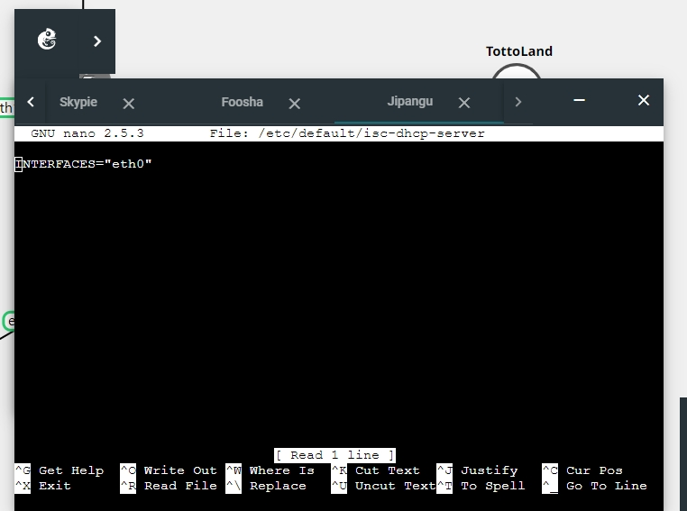
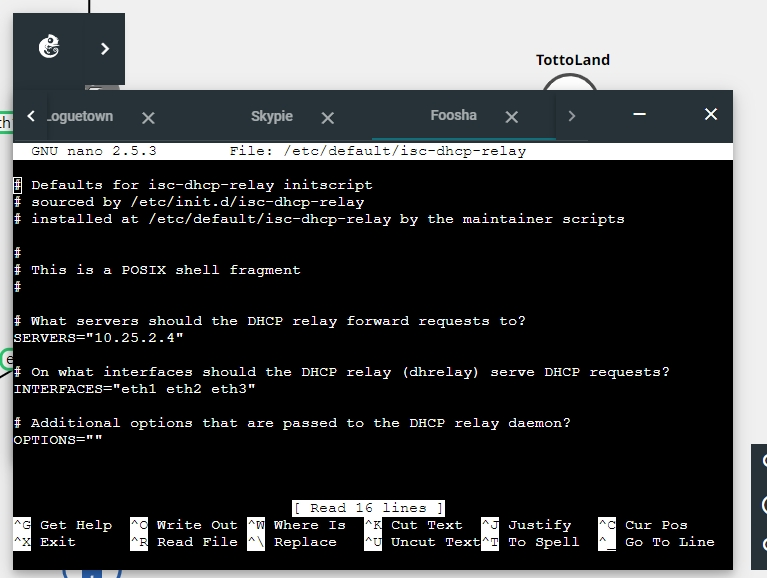
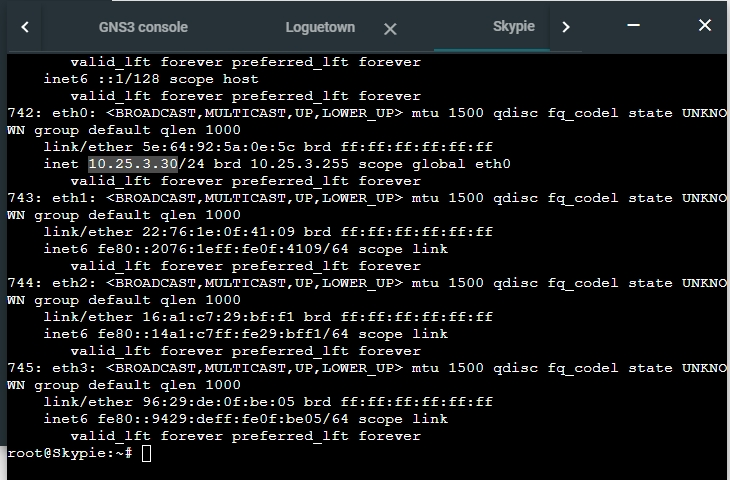
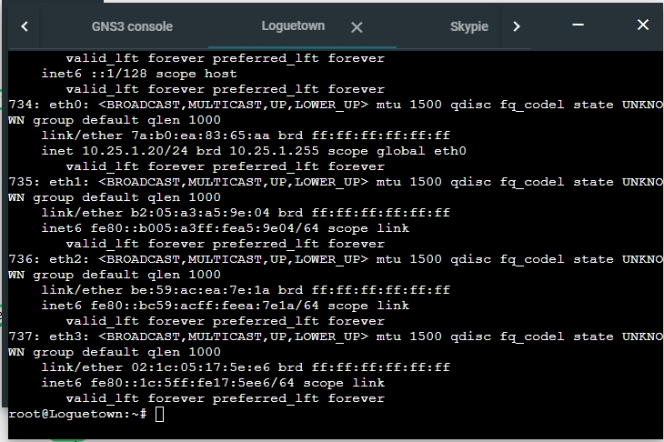
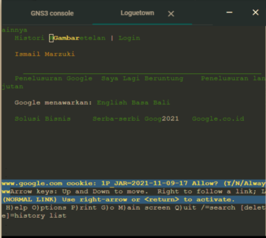
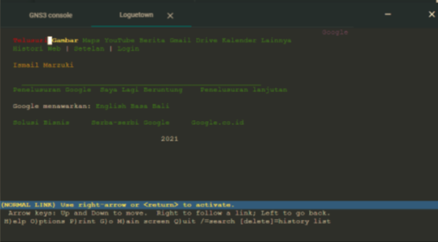

# Jarkom-Modul-3-D08-2021
- 05111940000233 Aristya Vika Wijaya
- 05111940000199	Aprilia Annisa Suryo
- 05111940000188	Riki Wahyu Nur Dianto

## Konfigurasi Node
### Foosha
``` bash
auto eth0
iface eth0 inet dhcp

auto eth1
iface eth1 inet static
	address 10.25.1.1
	netmask 255.255.255.0

auto eth2
iface eth2 inet static
	address 10.25.2.1
	netmask 255.255.255.0

auto eth3
iface eth3 inet static
  address 10.25.3.1
	netmask 255.255.255.0
```

### Jipangu
``` bash
auto eth0
iface eth0 inet static
	address 10.25.2.4
	netmask 255.255.255.0
	gateway 10.25.2.1
```

### Water7
``` bash
auto eth0
iface eth0 inet static
	address 10.25.2.3
	netmask 255.255.255.0
	gateway 10.25.2.1
```

### EinesLobby
``` bash
auto eth0
iface eth0 inet static
	address 10.25.2.2
	netmask 255.255.255.0
	gateway 10.25.2.1

```

### Skypie
``` bash
auto eth0
iface eth0 inet dhcp
```

### Alabasta
``` bash
auto eth0
iface eth0 inet dhcp
```

### Longutown
``` bash
auto eth0
iface eth0 inet dhcp
```

### TottoLand
``` bash
auto eth0
iface eth0 inet dhcp
```


## NOMOR 1
Luffy bersama Zoro berencana membuat peta tersebut dengan kriteria EniesLobby sebagai DNS Server, Jipangu sebagai DHCP Server, Water7 sebagai Proxy Server

### JAWAB
Di Console  *Foosha*
lakukan command `iptables -t nat -A POSTROUTING -o eth0 -j MASQUERADE -s 10.25.0.0/16` agar dapat terhubung ke jaringan luar pada router `Foosha`.
Pada EniesLobby, Water7, Jipangu lakukan command `echo "nameserver 192.168.122.1" > /etc/resolv.conf` untuk setting IP DNS.
(letakkan di .bashrc agar dijalankan saat di start)
 
*EniesLobby*
pada EniesLobby command `apt-get update`,`apt-get install bind9 -y`,`apt-get install nano` untuk menginstall bind9.
(letakkan di .bashrc agar dijalankan saat di start)

*Jipangu*
pada Jipangu jalankan command `apt-get update` dan `apt-get install isc-dhcp-server -y` untuk menginstall isc-dhcp-server karena jipangu berperan sebagai DHCP server.
Kemudian setting `INTERFACES` yang digunakan oleh Jipangu dengan mengedit file `/etc/default/isc-dhcp-server` dan menambahkan `eth0`.
(letakkan di .bashrc agar dijalankan saat di start)



*Water7*
pada Water7  command `apt-get update` dan `apt-get install squid -y` untuk menginstall squid.(letakkan di .bashrc agar dijalankan saat di start)

## NOMOR 2
Foosha sebagai DHCP Relay

### jawab
*Foosha*
pada Foosha jalankan command `apt-get update` dan `apt-get install isc-dhcp-relay -y` untuk menginstall isc-dhcp-relay karena foosha berperan sebagai dhcp relay.

lalu mengedit isi file `/etc/default/isc-dhcp-relay` dengan menambahkan `SERVER = "10.25.2.4"` yaitu server jipangu sebagai dhcp server dan mengedit bagian interfaces dengan `INTERFACES = "eth1 eth2 eth3"`



setelah itu jalankan command `service isc-dhcp-relay restart` pada console foosha.

## NOMOR 3 sampai 7
Client yang melalui Switch1 mendapatkan range IP dari [prefix IP].1.20 - [prefix IP].1.99 dan [prefix IP].1.150 - [prefix IP].1.169
Client yang melalui Switch3 mendapatkan range IP dari [prefix IP].3.30 - [prefix IP].3.50
Client mendapatkan DNS dari EniesLobby dan client dapat terhubung dengan internet melalui DNS tersebut.
Lama waktu DHCP server meminjamkan alamat IP kepada Client yang melalui Switch1 selama 6 menit sedangkan pada client yang melalui Switch3 selama 12 menit. Dengan waktu maksimal yang dialokasikan untuk peminjaman alamat IP selama 120 menit.
Luffy dan Zoro berencana menjadikan Skypie sebagai server untuk jual beli kapal yang dimilikinya dengan alamat IP yang tetap dengan IP [prefix IP].3.69

### Jawab
mengedit file `/etc/dhcp/dhcpd.conf` di foosha dengan menambahkan 
```bash
subnet 10.25.1.0 netmask 255.255.255.0 {
    	range 10.25.1.20 10.25.1.99;
    	range 10.25.1.150 10.25.1.169;
    	option routers 10.25.1.1;
    	option broadcast-address 10.25.1.255;
    	option domain-name-servers 10.25.2.2;
    	default-lease-time 360;
    	max-lease-time 7200;
    }

```

untuk switch 1, dengan range `range 10.25.1.20 10.25.1.99; range 10.25.1.150 10.25.1.169;` serta default lease time 6 menit =360 detik dan  max lease time 120 menit =7200 detik

dan untuk switch 3, dengan `range 10.25.3.30 10.25.3.50;` serta default lease time 12 menit =720 detik dan  max lease time 120 menit =7200 detik.

```bash
subnet 10.25.3.0 netmask 255.255.255.0 {
    	range 10.25.3.30 10.25.3.50;
    	option routers 10.25.3.1;
    	option broadcast-address 10.25.3.255;
    	option domain-name-servers 10.25.2.2;
    	default-lease-time 720;
    	max-lease-time 7200;
    }
```

untuk switch 2  karena tidak digunakan apada soa maka bisa dikosongkan dengan menulis
```bash
subnet 10.25.2.0 netmask 255.255.255.0 {
    }
```

karena luffy dan zoro berencana menjadikan Skypie sebagai server untuk jua beli kapal maka pada file yang sama ditambahkan
```bash
 host Skypie {
    	hardware ethernet "5e:64:92:5a:0e:5c";
    	fixed-address 10.25.3.69;
    }
```

setelah itu bisa menjalankan command `service isc-dhcp-server restart` pada foosha.

agr client mendapatkan DNS dari EniesLobby dan client dapat terhubung dengan internet melalui DNS maka pada di *Enieslobby*
lalkukan edit pada file `/etc/bind/named.conf.options` dengan mengedit bagian forwarders menjadi
``` bash
forwarders {
    	"192.168.122.1";
    };
```

dan menambahkan `allow-query{any;};` serta melakukan comment pada bagian  `// dnssec-validation auto;`
Setelah itu jalankan command `service bind9 restart`.

Lakukan restart pada client dan cek dengan melakukan command `ip a` untuk mengecek apakah cliet sudah terhubung internet dan sesuai dengan range ip yang ditentukan.

contoh client loguetown dan skypie.





## NOMOR 8
Pada Loguetown, proxy harus bisa diakses dengan nama jualbelikapal.yyy.com dengan port yang digunakan adalah 5000

### Jawab
*Water7*

Pada water7 di command jalankan `apt-get update` dan `apt-get install `apt-get install squid`.
Lalu backup file dengan menjalankan `mv /etc/squid/squid.conf /etc/squid/squid.conf.bak`.

Lalu edit file `/etc/squid/squid.conf` di water7 dengan menambahkan:

```bash
http_port 5000
visible_hostname jualbelikapal.d08.com
http_access allow ALL
```
kemudian lakukan `service squid restart`

*Loguetown*

Lalu pada Loguetown di command jalankan `apt-get update` dan `apt-get install lynx`
dan coba jalankan di command `lynx google.com`


## NOMOR 9
Agar transaksi jual beli lebih aman dan pengguna website ada dua orang, proxy dipasang autentikasi user proxy dengan enkripsi MD5 dengan dua username, yaitu luffybelikapalyyy dengan password luffy_yyy dan zorobelikapalyyy dengan password zoro_yyy.

### Jawab
*Water7*

Pada water7 di command jalankan `install apache2-utils -y`.

Kemudian membuat username dan password untuk user, dengan menjalankan command:

`htpasswd -c /etc/squid/passwd luffybelikapald08`
dan password : `luffy_d08`

`htpasswd /etc/squid/passwd zorobelikapald08`
dan password : `zoro_d08`

Lalu edit file `/etc/squid/squid.conf` di water7 dengan menambahkan:
```bash
auth_param basic program /usr/lib/squid/basic_ncsa_auth /etc/squid/passwd
auth_param basic children 5
auth_param basic realm Proxy
auth_param basic credentialsttl 2 hours
auth_param basic casesensitive on
acl USERS proxy_auth REQUIRED
http_access allow USERS
```

kemudian lakukan `service squid restart`

*Loguetown*
sebelum melakukan percobaan lynx, jangan lupa untuk mengeksport proxy dari water7 `export http_proxy="http://10.25.2.3:5000"`. 
Kemudian lakukan `lynx google.com`


## NOMOR 10
Transaksi jual beli tidak dilakukan setiap hari, oleh karena itu akses internet dibatasi hanya dapat diakses setiap hari Senin-Kamis pukul 07.00-11.00 dan setiap hari Selasa-Jum’at pukul 17.00-03.00 keesokan harinya (sampai Sabtu pukul 03.00)

### Jawab
*Water7*

Edit file `/etc/squid/acl.conf` untuk melakukan batas akses sebagai berikut 

```bash
    acl AVAILABLE_WORKING time MTWH 07:00-11:00
    acl AVAILABLE_WORKING time TWHF 17:00-23:59
    acl AVAILABLE_WORKING time WHFA 00:00-03:00
```

Kemudian edit file `/etc/squid/squid.conf` 

```bash
include /etc/squid/acl.conf

http_port 5000
visible_hostname jualbelikapal.d08.com

auth_param basic program /usr/lib/squid/basic_ncsa_auth /etc/squid/passwd
auth_param basic children 5
auth_param basic realm Proxy
auth_param basic credentialsttl 2 hours
auth_param basic casesensitive on
acl USERS proxy_auth REQUIRED
http_access allow USERS AVAILABLE_WORKING
http_access deny all
```
kemudian lakukan `service squid restart`

*Loguetown*
Jalankan di command `lynx google.com`
